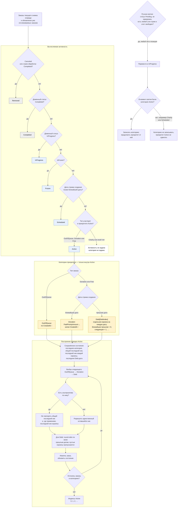

# Активность и приоритет заказов на разбор

**Легенда и границы.** Очередь здесь — текущий снимок, а не доменный статус. При начальной загрузке в него входят `Preorder`, `AwaitingPayment`, `Pending`, `InProgress` и только те `Completed`, чей стрим обработки ещё `Live`. `Canceled` и заказы с завершённым стримом обработки временно получают `Removed`, если они уже отслеживались, после чего удаляются из снимка. `ReviewOrderStatus`, `ReviewOrderType`, вычисляемая активность и `QueueCategory` — разные измерения; `Free` использует те же корзины `Donation`/`Debt`, что и `Donation`. `Charity` не получает ни `Active`, ни категорию. Схема показывает только вычисление активности и приоритета `Active`: она не запрещает вручную взять любой незамороженный `Pending`, включая `Charity` и `Scheduled`.
