# Жизненный цикл заказа разбора

```mermaid
stateDiagram-v2
    direction LR

    state "Предзаказ<br/>Preorder" as Preorder
    state "Ожидает оплаты<br/>AwaitingPayment" as AwaitingPayment
    state "Ожидает взятия в работу<br/>Pending" as Pending
    state "В работе<br/>InProgress" as InProgress
    state "Выполнен<br/>Completed" as Completed
    state "Отменён<br/>Canceled" as Canceled

    [*] --> Preorder : CreateDonation / CreateFree / CreateOutOfQueue / CreateCharity<br/>TrackUrl отсутствует
    [*] --> AwaitingPayment : CreateDonation<br/>TrackUrl есть, оплаты недостаточно
    [*] --> Pending : CreateDonation<br/>TrackUrl есть, оплаты достаточно
    [*] --> Pending : CreateFree / CreateOutOfQueue / CreateCharity<br/>TrackUrl есть

    Preorder --> Preorder : Pay · Donation<br/>TrackUrl отсутствует
    Preorder --> Preorder : Pay · Free<br/>статус и PayableAmount не меняются
    Preorder --> AwaitingPayment : Add/change TrackUrl<br/>донат, оплаты недостаточно
    Preorder --> Pending : Add/change TrackUrl<br/>Donation: оплаты достаточно<br/>Free / OutOfQueue / Charity: оплата не нужна

    AwaitingPayment --> AwaitingPayment : Pay · Donation<br/>оплаты всё ещё недостаточно
    AwaitingPayment --> Pending : Pay · Donation<br/>оплаты достаточно
    AwaitingPayment --> AwaitingPayment : Pay · Free<br/>статус и PayableAmount не меняются
    AwaitingPayment --> AwaitingPayment : Add/change TrackUrl<br/>Donation: оплаты недостаточно
    AwaitingPayment --> Pending : Add/change TrackUrl<br/>Donation: оплаты достаточно<br/>Free / OutOfQueue / Charity: оплата не нужна

    Pending --> Pending : Pay · Donation<br/>статус остаётся Pending
    Pending --> Pending : Pay · Free<br/>статус и PayableAmount не меняются
    Pending --> AwaitingPayment : Add/change TrackUrl · Donation<br/>новая длительность требует доплаты
    Pending --> Pending : Add/change TrackUrl<br/>Donation: оплаты достаточно<br/>Free / OutOfQueue / Charity: оплата не нужна

    Pending --> InProgress : Take<br/>IsFrozen = false, есть любой запущенный Live-стрим,<br/>слот свободен; стрим становится ProcessingStream
    InProgress --> Completed : Complete

    Preorder --> Canceled : Cancel
    AwaitingPayment --> Canceled : Cancel
    Pending --> Canceled : Cancel
    InProgress --> Canceled : Cancel

    Completed --> [*]
    Canceled --> [*]
```

**Легенда и границы.** `TrackUrl` — ссылка на трек, а `TrackDurationSeconds` — его длительность; это не карточка `Track`: создание и наполнение карточки каталога находится вне scope `review-order`. Операции создания назначают **стрим создания** (`CreationStream`); `Take` отдельно фиксирует выбранный запущенный `Live`-стрим как стрим обработки (`ProcessingStream`). `Pay` допустим только для `Donation` и `Free` в статусах `Preorder` / `AwaitingPayment` / `Pending`: у `Donation` он пересчитывает статус и `PayableAmount`, у `Free` сохраняет их и меняет только приоритет очереди; `Charity` и `OutOfQueue` денежную оплату не принимают. `Add/change TrackUrl` не удаляет ссылку и применяет правила статуса конкретного типа заказа. Оплата допустима для замороженного заказа и не снимает `IsFrozen`; freeze/unfreeze не меняют доменный статус и здесь отражены только guard-условием `Take`.
