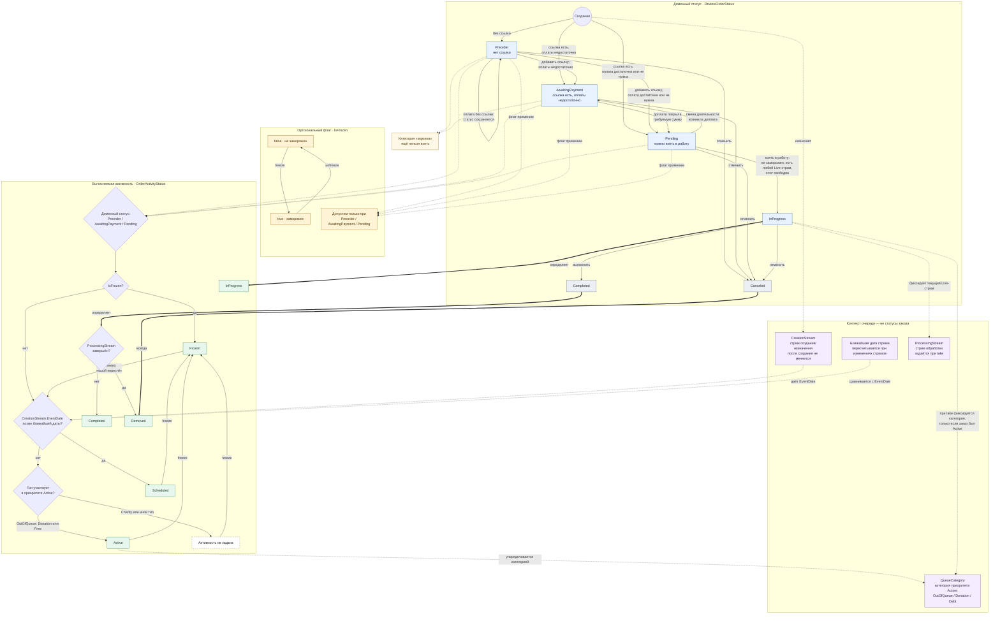

# Статусы и активность заказа разбора

Легенда:

- **Статус** — сохранённое доменное состояние заказа; `Preorder` и `AwaitingPayment` — разные статусы одной смысловой категории «корзина».
- **Активность** — вычисляемое положение заказа в очереди. `Scheduled`, `Frozen` и `Removed` не являются доменными статусами.
- **Флаг** `IsFrozen` не меняет статус. После разморозки активность вычисляется заново по неизменному стриму создания, текущей ближайшей дате и типу заказа; прежняя позиция не восстанавливается.
- **Категория** задаёт приоритет только внутри активной очереди и не определяет, можно ли взять конкретный `Pending`-заказ.
- **Стрим создания** назначает заказ при создании; **стрим обработки** фиксируется отдельно при взятии в работу.
