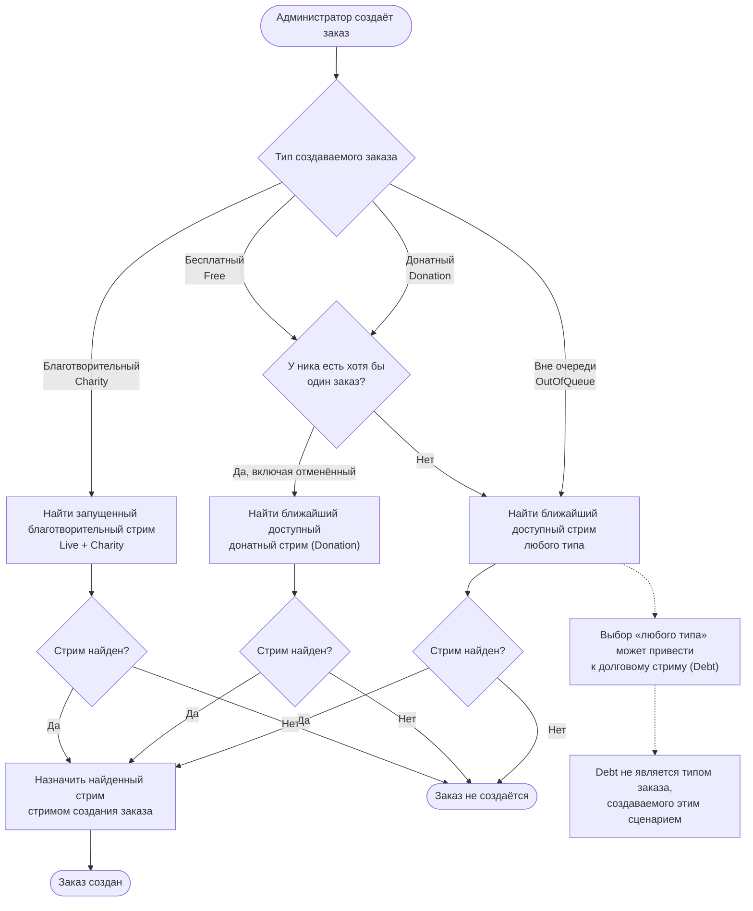

# Назначение стрима при создании заказа

**Легенда и границы.** Ближайший доступный стрим — запущенный либо запланированный на сегодня или будущее, с самой ранней датой. Для `Charity` подходит только уже запущенный стрим `Live + Charity`; история ника не учитывается. Диаграмма показывает только выбор **стрима создания**: стрим, на котором заказ позднее возьмут в работу и обработают, может отличаться.
