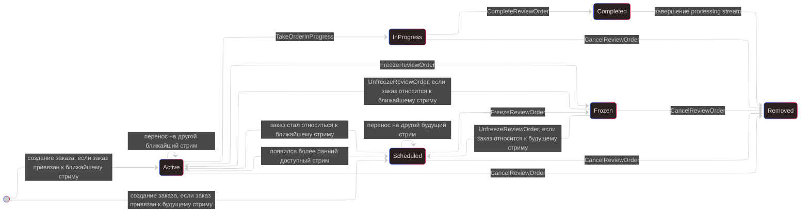

# Граф переходов статусов активности заказа

## Mermaid

## Описание
`OrderActivityStatus` не хранится в заказе как постоянное доменное состояние. Это вычисляемый статус позиции заказа в очереди, который живет в памяти `OrderQueueManager` и зависит от:
- `ReviewOrder.Status`
- `IsFrozen`
- даты `CreationStream.EventDate`
- текущего `NearestStreamDate`
- состояния `ProcessingStream`

## Правила переходов
- `Unspecified` не показывается на графе: это внутреннее промежуточное состояние позиции до пересчета очереди.
- При создании заказа возможны только `Active` или `Scheduled`.
- `Frozen` назначается только вручную через `FreezeReviewOrder`.
- Переход `Scheduled -> InProgress` запрещен бизнес-правилом.
- `Completed` может перейти только в `Removed`.
- `Removed` является терминальным состоянием.
- Переходы `Scheduled <-> Active` определяются сменой ближайшего доступного стрима.
- Прямых переходов из-за `StreamCanceled` нет: сначала заказы `Preorder` и `Pending` должны быть перенесены на другой стрим.
- Идемпотентные повторные вызовы и скрытые внутренние перерасчеты на диаграмме не отображаются.

## Переходы
| Откуда | Куда | Источник перехода | Условия |
| --- | --- | --- | --- |
| `-` | `Active` | Создание заказа | Заказ сразу относится к ближайшему доступному стриму |
| `-` | `Scheduled` | Создание заказа | Заказ относится к будущему стриму |
| `Active` | `InProgress` | `TakeOrderInProgress` | Заказ взят в работу |
| `InProgress` | `Completed` | `CompleteReviewOrder` | Заказ выполнен |
| `Completed` | `Removed` | `StreamCompleted` | Завершен `ProcessingStream`, в котором заказ был выполнен |
| `Active` | `Frozen` | `FreezeReviewOrder` | Заказ замораживается |
| `Scheduled` | `Frozen` | `FreezeReviewOrder` | Заказ замораживается |
| `Frozen` | `Active` | `UnfreezeReviewOrder` | После разморозки заказ относится к ближайшему доступному стриму |
| `Frozen` | `Scheduled` | `UnfreezeReviewOrder` | После разморозки заказ относится к будущему стриму |
| `Active` | `Removed` | `CancelReviewOrder` | Заказ отменен |
| `Scheduled` | `Removed` | `CancelReviewOrder` | Заказ отменен |
| `Frozen` | `Removed` | `CancelReviewOrder` | Заказ отменен |
| `InProgress` | `Removed` | `CancelReviewOrder` | Заказ отменен во время выполнения |
| `Scheduled` | `Active` | Событие стрима / перерасчет очереди | Заказ стал относиться к ближайшему стриму, обычно после завершения текущего стрима |
| `Active` | `Scheduled` | Событие стрима / перерасчет очереди | Появился более ранний доступный стрим |
| `Scheduled` | `Scheduled` | Перенос заказа на другой стрим | Заказ перенесен на другой будущий стрим |
| `Active` | `Active` | Перенос заказа на другой стрим | Заказ перенесен на другой ближайший стрим |

## Примечание по реализации
Текущее бизнес-правило требует запрещать переход `Scheduled -> InProgress`, но в текущей реализации `ReviewOrderService.TakeInProgress()` это ограничение явно не проверяется. То есть описание графа уже отражает целевое правило, а код в этом месте еще требует доработки.
