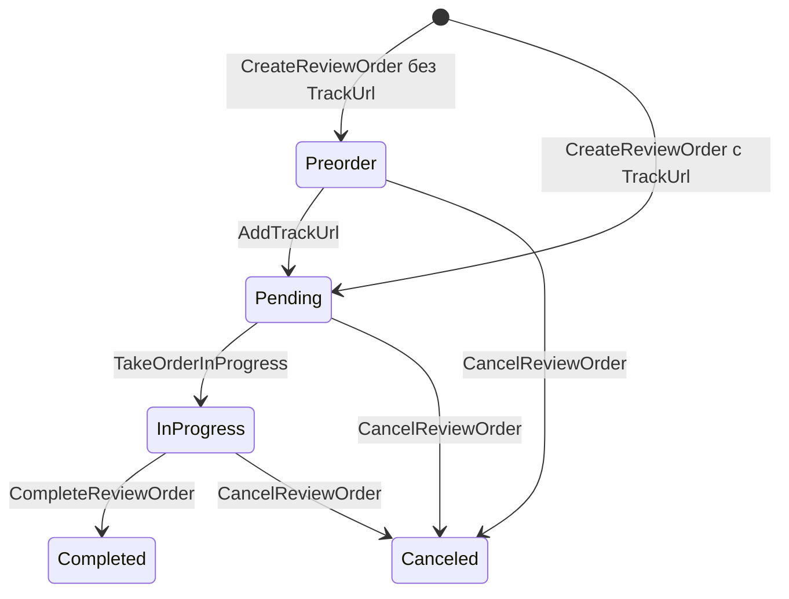

# Граф переходов статусов ReviewOrder

## Mermaid

## Правила переходов
- `Unspecified` недопустим и не входит в граф.
- `Completed` и `Canceled` являются терминальными статусами.
- Обратных переходов нет.
- Удаление `TrackUrl` невозможно, поэтому переход `Pending -> Preorder` исключен.
- `FreezeReviewOrder` и `UnfreezeReviewOrder` не изменяют `Status`.
- Идемпотентные повторные вызовы считаются `no-op` и на диаграмме не отображаются.
- Тип заказа не влияет на допустимые переходы статусов.

## Переходы
| Откуда | Куда | Операция | Условия |
| --- | --- | --- | --- |
| `-` | `Preorder` | `CreateReviewOrder` | `TrackUrl` не передан |
| `-` | `Pending` | `CreateReviewOrder` | `TrackUrl` передан |
| `Preorder` | `Pending` | `AddTrackUrl` | В заказ добавляется ссылка на трек |
| `Pending` | `InProgress` | `TakeOrderInProgress` | Заказ не заморожен |
| `InProgress` | `Completed` | `CompleteReviewOrder` | Заказ находится в работе |
| `Preorder` | `Canceled` | `CancelReviewOrder` | Отмена разрешена |
| `Pending` | `Canceled` | `CancelReviewOrder` | Отмена разрешена |
| `InProgress` | `Canceled` | `CancelReviewOrder` | Отмена разрешена |
