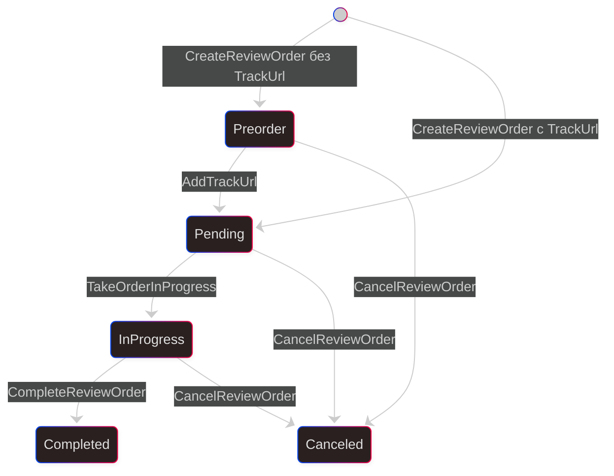

# Граф переходов статусов ReviewOrder

## Что отражает граф

Этот граф описывает только persisted-статус `ReviewOrder.Status`.
Он не описывает вычисляемую активность позиции заказа в очереди. Для нее используется `../order-queue/order-activity-status-graph.md`.

## Mermaid

## Правила переходов

- `Unspecified` не является допустимым persisted-статусом заказа и не входит в граф.
- `Completed` и `Canceled` являются терминальными статусами.
- Обратных переходов нет.
- Удаление `TrackUrl` не поддерживается, поэтому переход `Pending -> Preorder` исключен.
- `FreezeReviewOrder` и `UnfreezeReviewOrder` не изменяют `ReviewOrder.Status`.
- Идемпотентные повторные вызовы считаются `no-op` и на диаграмме не отображаются.
- Тип заказа не влияет на допустимые переходы persisted-статусов.

## Переходы persisted-статуса

| Откуда | Куда | Операция | Условия |
| --- | --- | --- | --- |
| `-` | `Preorder` | `CreateReviewOrder` | `TrackUrl` не передан |
| `-` | `Pending` | `CreateReviewOrder` | `TrackUrl` передан |
| `Preorder` | `Pending` | `AddTrackUrl` | В заказ добавляется ссылка на трек |
| `Pending` | `InProgress` | `TakeOrderInProgress` | Заказ не заморожен и взят в работу |
| `InProgress` | `Completed` | `CompleteReviewOrder` | Заказ находится в работе |
| `Preorder` | `Canceled` | `CancelReviewOrder` | Отмена разрешена |
| `Pending` | `Canceled` | `CancelReviewOrder` | Отмена разрешена |
| `InProgress` | `Canceled` | `CancelReviewOrder` | Отмена разрешена |

## Допустимые операции без смены persisted-статуса

| Статус | Операция | Что происходит |
| --- | --- | --- |
| `Pending` | `AddTrackUrl` | Обновляется `TrackUrl`, статус не меняется |
| `InProgress` | `AddTrackUrl` | Обновляется `TrackUrl`, статус не меняется |
| `Preorder` | `FreezeReviewOrder` | Меняется `IsFrozen`, статус не меняется |
| `Pending` | `FreezeReviewOrder` | Меняется `IsFrozen`, статус не меняется |
| `Preorder` | `UnfreezeReviewOrder` | Меняется `IsFrozen`, статус не меняется |
| `Pending` | `UnfreezeReviewOrder` | Меняется `IsFrozen`, статус не меняется |

## Примечания по событиям

- В событиях создания заказа `ReviewOrderChangedEvent` публикуется с `PreviousStatus = Unspecified`.
- Это значение относится к payload события и не означает, что persisted-статус созданного заказа равен `Unspecified`.
